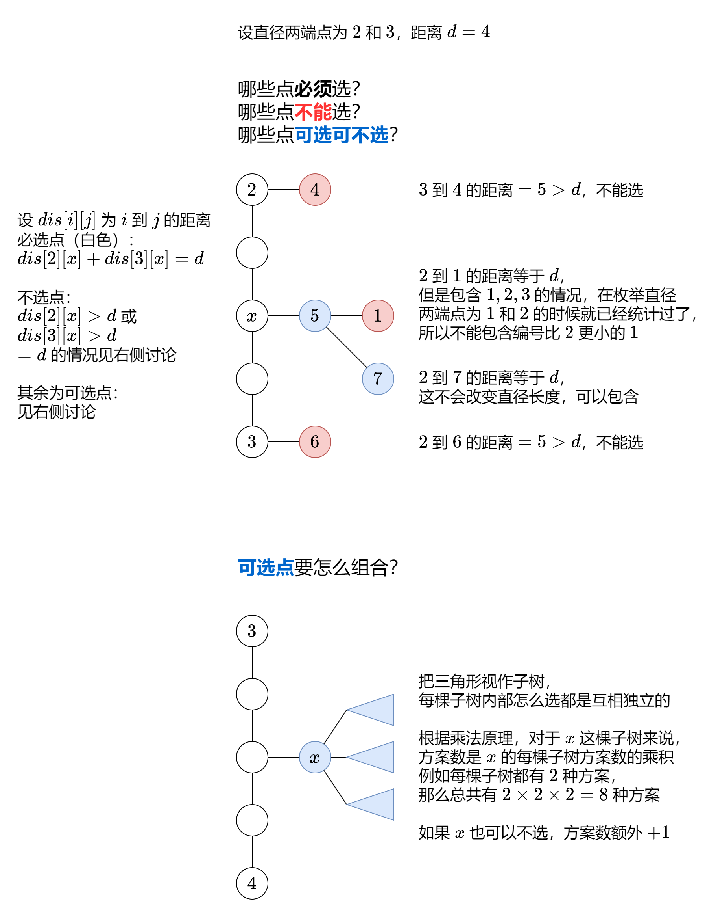

# [Description](https://leetcode.cn/problems/count-subtrees-with-max-distance-between-cities/description/)

## Code

感觉是第一次遇到不同知识点组合的题目，起初根本没想到需要回溯。首先通过回溯找到所有的子集，对于每一个子集，还需要验证它是否是一棵树（在求直径的过程中记录走过的点，最后与子集进行比较），对现在的我来说有点复杂。消化完题解思路之后，光是复现代码逻辑+跑通就用了20min，实在不是自己能独立解决的问题

```cpp
class Solution {
public:
    vector<int> countSubgraphsForEachDiameter(int n, vector<vector<int>>& edges) {
        // 通过回溯求所有子集
        // 对于每个子集，求其直径，并且在求直径的过程中记录经过的点
        // 如果经过的点和这个子集本身相同，说明子集是一棵树，否则说明子集是一个森林
        
        // 建树
        std::vector<std::vector<int>> tree(n);
        for (auto &edge : edges) {
            int x = edge[0] - 1;
            int y = edge[1] - 1;
            tree[x].push_back(y);
            tree[y].push_back(x);
        }

        // 记录子集节点的selected
        // 记录是否遍历到的visited
        std::vector<bool> selected(n, false), visited(n, false);
        // 答案
        std::vector<int> results(n - 1, 0);

        // 求直径dfs
        int diameter = 0;
        auto dfs1 = [&](auto &&dfs1, int node) -> int {
            visited[node] = true;
            int max_len = 0;
            for (auto &child : tree[node]) {
                if (!visited[child] && selected[child]) {
                    int len = dfs1(dfs1, child) + 1;
                    diameter = std::max(diameter, max_len + len);
                    max_len = std::max(max_len, len);
                }
            }
            return max_len;
        };

        // 回溯dfs
        auto dfs2 = [&](auto &&dfs2, int i) -> void {
            if (i == n) {
                // 本次回溯结束，找当前子集的直径
                for (int v = 0; v < n; ++v) {
                    if (selected[v]) {
                        // 找到了一个子集节点，将其作为根节点开始求树的直径
                        std::fill(visited.begin(), visited.end(), false);
                        diameter = 0;
                        dfs1(dfs1, v);
                        break;
                    }
                }
                // 判断是否要更新答案
                // 这里卡了挺久的，忘记了限制diameter > 0，因为有时候会仅选择一个节点
                if (diameter > 0 && visited == selected) {
                    results[diameter - 1] += 1;
                }
                return;
            }
            
            // 选
            selected[i] = true;
            dfs2(dfs2, i + 1);
            // 恢复现场 + 不选
            selected[i] = false;
            dfs2(dfs2, i + 1);
        };

        dfs2(dfs2, 0);
        return results;
    }
};
```

另外[题解](https://leetcode.cn/problems/count-subtrees-with-max-distance-between-cities/solutions/2162612/tu-jie-on3-mei-ju-zhi-jing-duan-dian-che-am2n)中还提供了回溯的二进制枚举写法，不再需要`dfs2`以及`selected`, `visited`数组了。回溯+树的直径计算这种方法的时间复杂度为 $O(n2^n)$ ，空间复杂度为 $O(n)$  
此外还有一种方法，暴力枚举两个节点**作为直径**，利用乘法原理计算答案，我感觉实在是太难想了，放一下题解里面的图片吧


